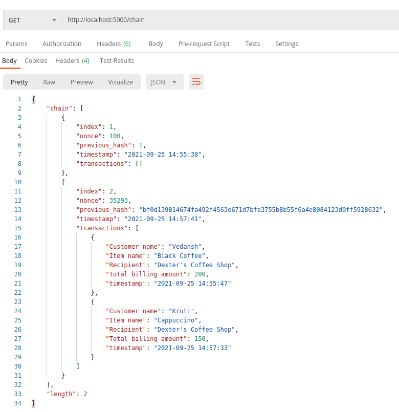

# Blockchain Assignment - 1

## Overview
Implementation of a simple blockchain for Dexter's coffee shop with the following functionalities:

* Dexter has information regarding all the available blocks
* None of the Dexter's friends are able to edit the added transactions
* Timestamp of each transaction is readily available
* Dexter has all the information regarding the completed transactions
* Dexter can add new nodes to the network resulting in a multi-node setup

## Implementation

* The user has information regarding all the available blocks. A typical block in our blockchain contains the index, timestamp, list of all transactions (minimum 2 per block), nonce and hash of the previous block. Each transaction in the block consists of the customer name, item ordered, total billing amount and readily available timestamp of ordering.

* None of the user's friends are able to edit the added transactions. Each block in the blockchain contains the hash of the previous block which makes it immutable. 

* We have maintained separate lists for verified and unverified transactions. So the user can view all the completed, verified transactions and the entire blockchain.

* The following API endpoints are created:
    1) `/transactions/new`

        This POST method initiates a new transaction and requires the user to enter the customer name, item name and total billing amount in JSON format.

        

    2) `/mine`

        This GET route mines a new block to the blockchain by calculating the proof of work. We will be able add a new block to the chain only if there are minimum 2 transactions in that block. Timestamp of each transaction are readily available.

        

    3) `/chain`

        This GET method facilitates the user to view its entire blockchain along with its length.

        

    4) `/nodes/add`

        This POST route requires the user to enter the list of URLs of the nodes to be added to the network. Make sure to run this endpoint from all ports before begining any transactions (in case you want to have a multi-node network).

        

    5) `chain/resolve`

        This endpoint finds the longest validated chain by checking all the neighbouring nodes in the network and resolves conflict if any.

## Tech stack 
* The project is built using Python-Flask framework and tested on Ubuntu.
* Postman was used to test and interact with the endpoints.

## How to run
1) Make sure Python 3.8+ , Flask and requests library is installed.
    * Download any version of Python (>3.8) from the [official website](https://www.python.org/downloads/).
    * `pip3 install flask`
    * `pip3 install requests`

2) `cd Blockchain` and run the server:
    * `python3 main.py`

        We can open different network ports on the same machine to simulate multinode network
    
    * `python3 main.py -p 5001`
    * `python3 main.py -p 5002`

3) Run the API endpoints on an HTTP Client like [Postman](https://www.postman.com/downloads/).

## Team members - (Group 15)
1) Kruti Baraiya (2019A7PS1260H)
2) Vedansh Srivastava (2019A7PS0323H)
3) Umang Agarwal (2019A7PS0185H)
